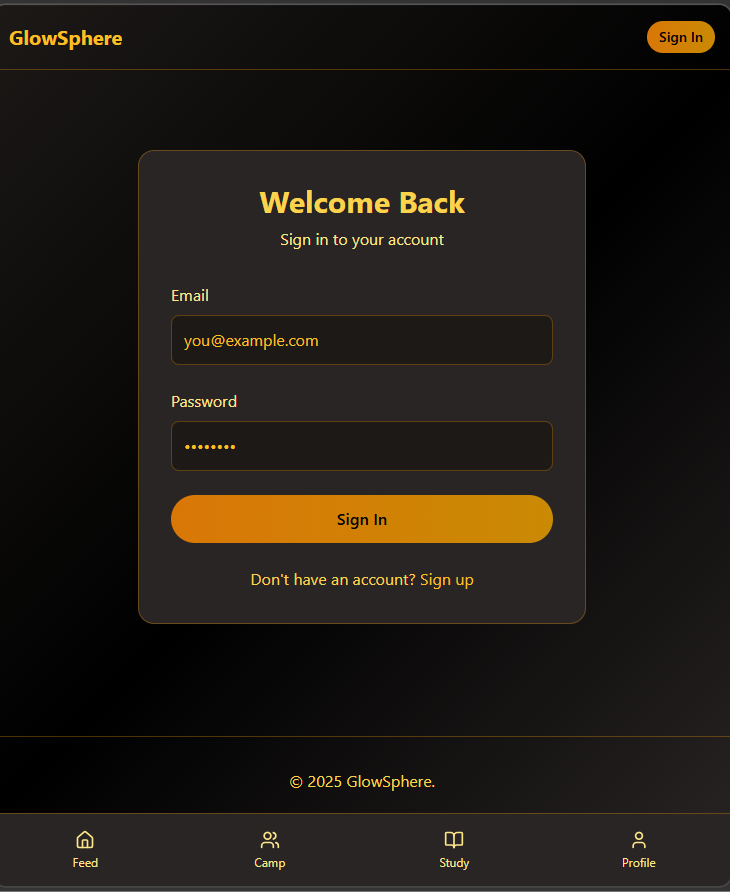

# GlowSphere - Social Learning Platform

GlowSphere is a mobile-first social learning app that combines group video conferencing, focused study tools, and a social feed for short videos and interactions.

## Features

### 🔥 Campfire (Group Video Chat)
- Secure, low-latency video conference rooms supporting 2–12 participants
- Unique join links with optional passcodes
- Host, co-host, and participant roles
- Audio/video controls, text chat, and raise hand feature
- Recording capabilities with consent management

### 📚 StudySuite (Focus Tools)
- Pomodoro timer with configurable intervals (default 25/5)
- Integrated note-taking area with rich-text support
- Session tracking and history
- Focus streaks and analytics
- Export and share notes functionality

### 📱 Feed (Social Video Feed)
- Instagram-like feed for short educational videos (15-60s)
- Like, comment, and share functionality
- Hashtag and user tagging
- Content discovery through following and recommendations
- Save/bookmark interesting content

## Tech Stack

- **Frontend**: React with Vite
- **Styling**: Tailwind CSS
- **Routing**: React Router
- **State Management**: React Context API
- **UI Components**: Lucide React icons

## Core Components

### Campfire
The Campfire component provides virtual study rooms where users can:
- Create and join video chat rooms
- Toggle audio/video settings
- Participate in group discussions
- Record sessions (with consent)
- Manage room participants

### StudySuite
The StudySuite component helps users focus on their studies with:
- A customizable Pomodoro timer
- Integrated note-taking during study sessions
- Session history and analytics
- Progress tracking and streaks

### Feed
The Feed component enables social learning through:
- Short educational video posts
- Social interactions (likes, comments, shares)
- Content discovery via hashtags and following
- User-generated learning content

## Responsive Design

GlowSphere is built with a mobile-first approach:
- Dedicated mobile navigation bar
- Responsive grid layouts
- Touch-friendly controls
- Optimized for both mobile and desktop experiences

